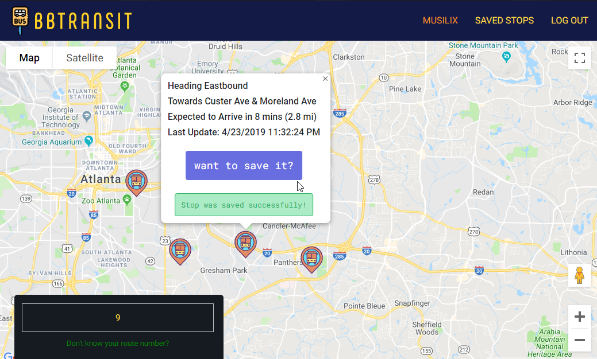
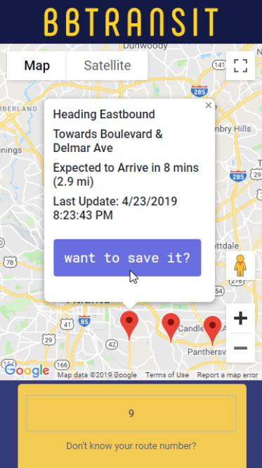

# :bus: BBTransit :bus:

&nbsp;&nbsp;

BBTransit is a web based transport alert app that aims to simplify the daily life of a commuter by offering access to simple yet meaningful info such as bus arrival times, destinations, locations, and their adherence to the schedule; all in real time.

It was initially made during my software engineering course, but I am trying to continue adding new, more updated functionality over time. Currently, it's focused on MARTA buses around Georgia, since MARTA's own apps for doing this are regarded to so poorly at the moment.

*BBtransit is no longer hosted online anymore either, as once the free tier ran out, so too, did I run out (the door, because I cant be expending money on keeping a server instance up). Everything is hosted here tho for future reference, n future commutin'*  :bus:
